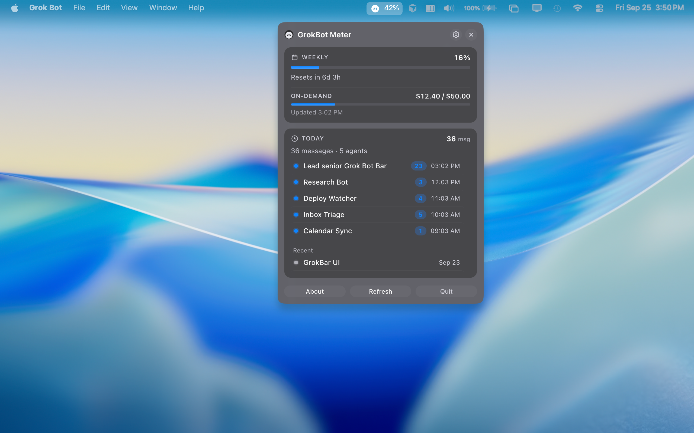
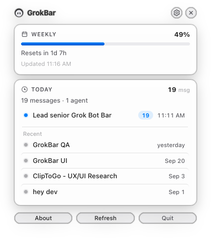
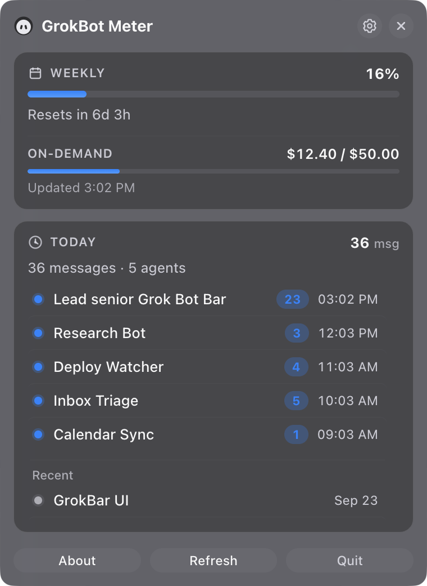

<div align="center">

<h1>
  
  GrokBot Meter
</h1>

**Your Grok Bot weekly usage, always one glance away in the macOS menu bar.**

[](https://github.com/nuno/grokbot-meter/releases)
[](https://github.com/nuno/grokbot-meter/releases)
[](LICENSE)
[](https://github.com/sponsors/nuno)

### [Download for macOS (Apple Silicon)](https://github.com/nuno/grokbot-meter/releases/latest)



</div>

## Highlights

- **Weekly % in the menu bar**: know where you stand without opening anything.
- **Reset countdown**: see exactly when your weekly meter resets.
- **Today at a glance**: messages, recent agents, and on-demand spend.
- **Native feel**: light and dark mode, tiny tray app, no Dock icon.
- **Honest and private**: official Grok Bot meters only, no estimates, no telemetry, no server of its own.

## Quick start

1. [Download the latest DMG](https://github.com/nuno/grokbot-meter/releases/latest).
2. Drag **GrokBot Meter** to Applications.
3. Open it and approve it once (see [First launch](#first-launch-gatekeeper)).

Click the menu bar icon for the full popup. Right-click for About and Quit.

Requires macOS on Apple Silicon and [Grok Bot](https://cursor.com) installed and signed in.

## Screenshots

<table>
  <tr>
    <td></td>
    <td></td>
  </tr>
  <tr>
    <td align="center">Light</td>
    <td align="center">Dark</td>
  </tr>
</table>


## First launch (Gatekeeper)

Builds are ad-hoc signed but not notarized yet, so macOS asks you to approve the app once.

<details>
<summary>Show steps</summary>

**macOS 15 Sequoia and later**

1. Open **GrokBot Meter** from Applications. When macOS says it can't verify the developer, click **Done**.
2. Go to **System Settings → Privacy & Security → Security** and click **Open Anyway**.
3. Confirm with **Open Anyway** and your password. Later launches open normally.

**macOS 14 Sonoma and earlier:** right-click the app → **Open** → **Open**.

If macOS says the app "is damaged and can't be opened", clear the quarantine flag:

```bash
xattr -dr com.apple.quarantine "/Applications/GrokBot Meter.app"
```

</details>

## Privacy

Everything runs on your Mac. GrokBot Meter only reads Grok Bot's local data (read-only) and calls the same Cursor servers Grok Bot already uses. It never writes to Grok Bot's files or touches your sign-in.

### What it accesses

| What | Why |
| ---- | --- |
| `~/Library/Application Support/Grok Bot/sand-client-persistence/*.blob` | Today's message count and recent agents |
| `~/Library/Application Support/Grok Bot/sand-secrets.json` | Grok Bot's encrypted access token |
| Keychain item **Grok Bot Safe Storage** | The key used to decrypt that token |
| `/Applications/Grok Bot.app/Contents/Info.plist` | Grok Bot version shown in About |
| `api2.cursor.sh`: `GetSandUsageStatus`, `GetCurrentPeriodUsage`, `GetMe` | Weekly %, on-demand spend, account email |

All file access is read-only. It never reads your refresh token or refreshes your sign-in. When the access token expires, the meter shows **Open Grok Bot to refresh sign-in**. These endpoints are undocumented and may change without notice.

<details>
<summary>About the Keychain prompt</summary>

On first load, macOS asks whether **security** (the built-in `/usr/bin/security` tool) may use "Grok Bot Safe Storage".

- **Allow** (recommended): works for this session; asked again next launch.
- **Always Allow**: no more prompts, but any program using the `security` tool could then read this key.
- **Deny**: the weekly meter shows **Keychain access denied** until you reopen the app. Today's activity still works.

</details>

## Build from source

Requires Node.js 20+.

```bash
git clone https://github.com/nuno/grokbot-meter.git
cd grokbot-meter
npm install
npm run electron:build
```

| Output | Path |
| ------ | ---- |
| Unpacked `.app` | `dist/mac-arm64/GrokBot Meter.app` |
| DMG / zip | `releases/<version>/` |

Release signing and notarization notes: [docs/MAC-RELEASE.md](docs/MAC-RELEASE.md).

### Development

```bash
npm run electron:dev    # Electron + hot reload
npm run electron:build  # ad-hoc signed arm64 app + DMG + zip
npm run icons:gen       # regenerate packaging / tray icons
```

See [docs/USER-GUIDE.md](docs/USER-GUIDE.md) and [CONTRIBUTING.md](CONTRIBUTING.md).

## Feedback

GrokBot Meter is in early public beta. Bugs and ideas are welcome in [Issues](https://github.com/nuno/grokbot-meter/issues). If it's useful to you, consider [sponsoring the project](https://github.com/sponsors/nuno).

---

Unofficial companion. Not affiliated with xAI, Cursor, or Apple.
[MIT](LICENSE) © 2026 Nuno Costa · [Security](SECURITY.md)
